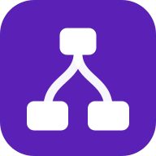

<div align="center">
  
  <h1>Money Map</h1>
  <p><strong>Visualize your finances as a living flow chart.</strong></p>
  <p>
    Map income, expenses, assets, and debt as nodes on a canvas. Wire them up,
    tweak assumptions, and watch your net worth, stats, and retirement
    projections update in real time.
  </p>
</div>

---

## Why

Spreadsheets are great at math and terrible at storytelling. Most budget apps
make you connect bank accounts, then bury the structure of your money behind
endless category lists. Money Map sits between the two: an interactive canvas
where the *shape* of your finances is the primary view, and the numbers fall
out of it.

- **Local-first** — every node, edge, and scenario lives in your browser. No
  signup, no bank linking, no analytics on your finances.
- **What-if scenarios** — duplicate a map, change one input, and compare
  futures side by side. Keep "base case", "switch jobs", "buy a house" as
  separate snapshots.
- **End-to-end** — the same model powers a dashboard of live stats and a
  long-horizon projection (FI number, early-retirement age, real vs. nominal
  net worth).

## Features

- **Flow-chart canvas** — drag nodes for income, checking, savings, emergency
  fund, brokerage/retirement, crypto, expenses, generic assets, and debt.
  Connect them with allocation or expense edges.
- **Live stats dashboard** — net worth, monthly cash flow, debt-to-income,
  asset allocation, expenses by category, and crypto holdings — recomputed
  the moment you change a node.
- **Retirement projections** — nominal and inflation-adjusted net worth
  through any target age, FI number via the safe-withdrawal rule, and the
  earliest age you hit FI based on your blended return.
- **Crypto-aware** — BTC, ETH, SOL prices stream in live and roll through
  every projection.
- **Scenarios** — first-class "save / duplicate / rename / switch" so
  long-term planning isn't a single fragile snapshot.
- **Light & dark themes** — auto-follows system, manually overridable.

## Quick start

```bash
pnpm install
pnpm dev          # http://localhost:3000
```

Open `/` for the marketing landing page. Open `/app` for the canvas.

## Tech stack

| Layer | Choice |
|---|---|
| Framework | [TanStack Start](https://tanstack.com/start) (Vite + Nitro SSR) |
| Routing | [TanStack Router](https://tanstack.com/router) (file-based) |
| Canvas | [React Flow / xyflow](https://reactflow.dev) |
| UI | [shadcn/ui](https://ui.shadcn.com) + [Tailwind v4](https://tailwindcss.com) |
| Charts | [Recharts](https://recharts.org) |
| State | React context + `localStorage` persistence (per scenario) |
| Forms | [TanStack Form](https://tanstack.com/form) + [Zod](https://zod.dev) |
| Tests | [Vitest](https://vitest.dev) (unit + integration) |
| Lint/Format | [Biome](https://biomejs.dev) |
| Icons | [Hugeicons](https://hugeicons.com) |

## Project structure

```
src/
├── routes/
│   ├── __root.tsx            # html shell, head meta, favicons, OG tags
│   ├── index.tsx             # marketing landing page (/)
│   ├── app.tsx               # /app layout — sidebars + flow providers
│   ├── app.index.tsx         # /app — the canvas
│   ├── app.stats.tsx         # /app/stats — dashboard
│   └── app.projections.tsx   # /app/projections — FI calculator
├── components/
│   ├── flow/                 # canvas, nodes, edges, node editors
│   ├── ui/                   # shadcn primitives
│   ├── sidebar-left.tsx      # nav + scenarios
│   └── sidebar-right.tsx     # contextual node editor
├── lib/
│   ├── projections.ts        # core long-horizon math
│   ├── allocation.ts         # edge allocation rules
│   ├── edge-rules.ts         # what can connect to what
│   ├── debt.ts               # amortization helpers
│   ├── stats.ts              # dashboard aggregations
│   └── ...                   # dates, format, chart-axis, storage
├── hooks/
└── styles.css                # tailwind + theme tokens
```

The flow model is the single source of truth — every other view (stats,
projections, sidebars) is a pure function of `nodes + edges`.

## Scripts

| Script | What it does |
|---|---|
| `pnpm dev` | Vite dev server on `:3000` |
| `pnpm build` | Production build via Nitro |
| `pnpm preview` | Preview the production build locally |
| `pnpm test` | Vitest unit + integration tests |
| `pnpm lint` | Biome lint |
| `pnpm format` | Biome format |
| `pnpm check` | Biome lint + format check |
| `pnpm icons` | Regenerate favicons / PWA icons / OG image from `scripts/generate-favicons.mjs` |

## Deployment

Built on Nitro, which auto-detects deploy targets via env. **Vercel** works
out of the box:

```bash
vercel              # or push to GitHub and import in the Vercel dashboard
```

Vercel sets `VERCEL=1`, Nitro switches to its Vercel preset automatically —
no `vercel.json` required. Build command: `pnpm build`. Output: `.output/`.

Same applies to **Netlify** (`NETLIFY=1`) and **Cloudflare Pages**
(`CF_PAGES=1`). To target one explicitly, set `NITRO_PRESET=vercel|netlify|cloudflare-pages`.

## Privacy

Money Map is local-first by design. Your scenarios, nodes, and assumptions
live in `localStorage`, scoped to your browser. The app makes one outbound
network call: a public, unauthenticated price lookup against a crypto price
API, only when a `cryptoNode` is on the canvas.

## License

MIT — see [LICENSE](./LICENSE).

---

Made by [Raymond Kneipp](https://raymondkneipp.com). Source on
[GitHub](https://github.com/raymondkneipp/money-map).
